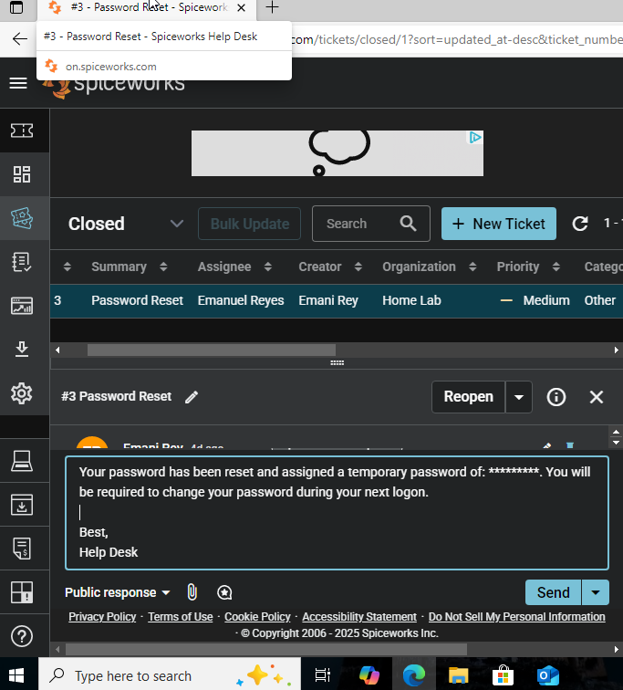
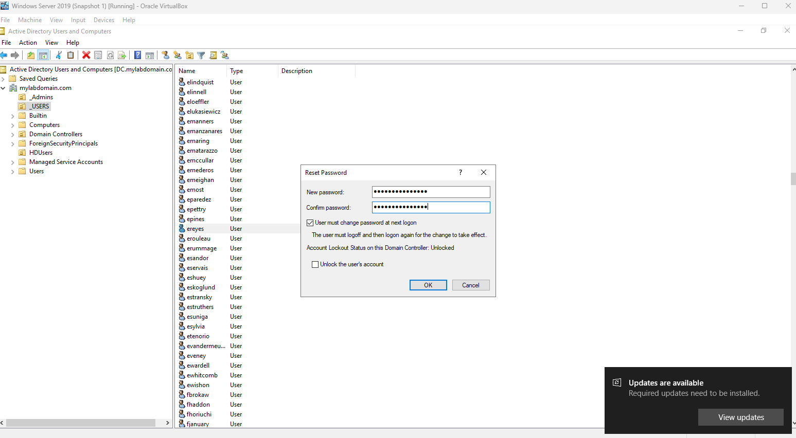

# Ticket #001 – Password Reset Request

**Date:** 2025-10-06  
**Requester:** erey  
**Priority:** Low  
**Category:** Account Management  
**Status:** Resolved  

---

## Description
User reported being unable to log in due to a forgotten password.

---

## Actions Taken
1. Verified user identity through AD Users and Computers (ADUC).  
2. Located `erey` account in Active Directory.  
3. Reset password using the **Reset Password** option.  
4. Checked the box **"User must change password at next logon"**.  
5. Communicated the reset procedure and temporary password to the user.

---

## Resolution
User successfully logged in and changed their password at next sign-on.

---

## Screenshots

   
  <em>Spiceworks message sent to user with temporary password and reset instructions.</em>

   
  <em>Active Directory Users and Computers Reset Password dialog showing “User must change password at next logon.”</em>

---

## Notes
This task simulated a common help desk ticket for user password resets.  
Skills demonstrated: **Active Directory user management, communication, ticket documentation**.
