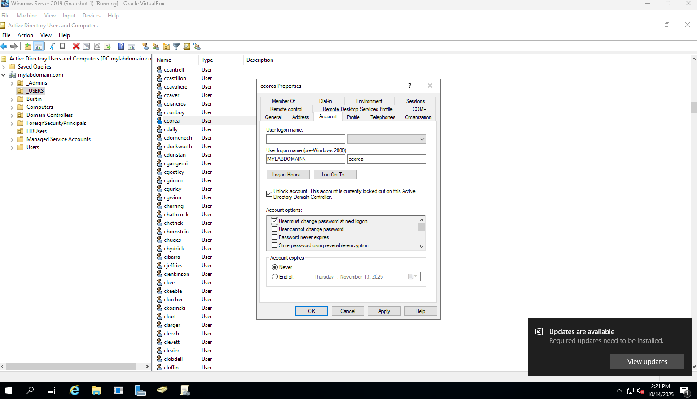
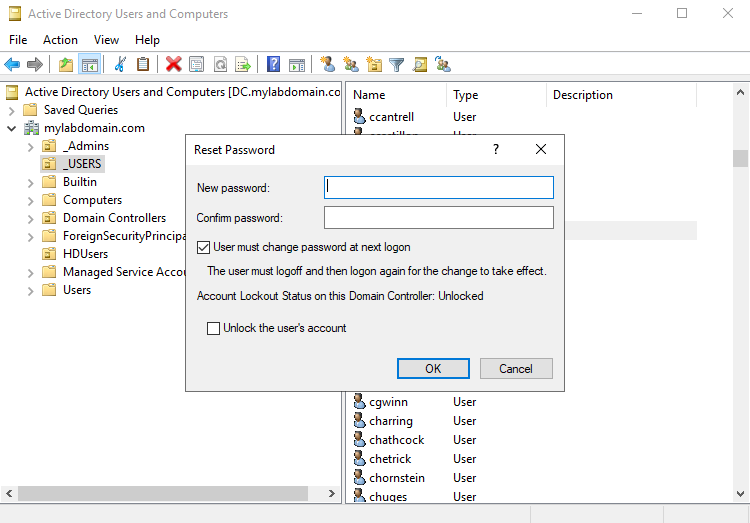
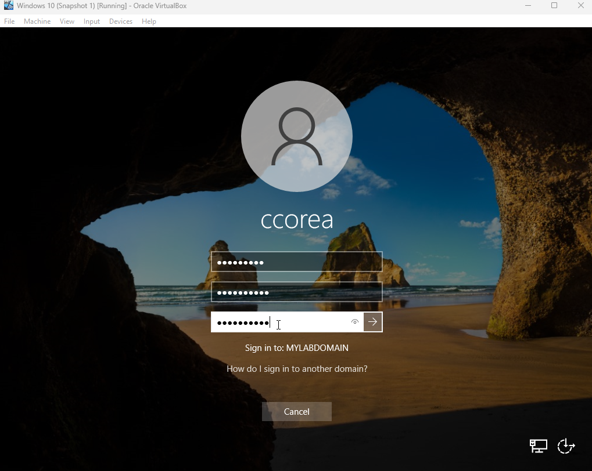
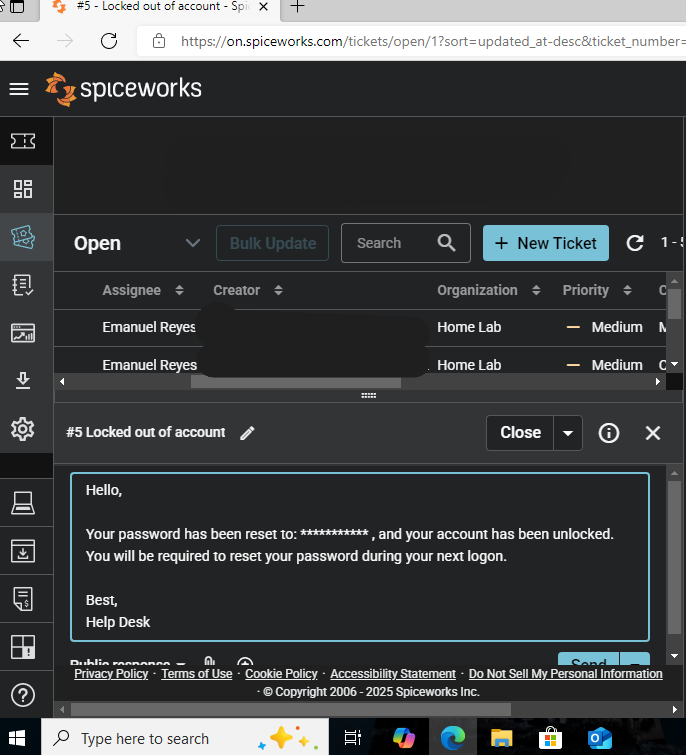

# Ticket #003 – Account Locked Out

**Date:** 2025-10-06  
**Requester:** ccorea  
**Priority:** Medium  
**Category:** Account Management  
**Status:** Resolved  

---

## Description
User was unable to log in due to multiple failed password attempts. Account was locked.

---

## Actions Taken
1. Located `ccorea` in Active Directory Users and Computers.  
2. Right-clicked → **Reset Password** and **Unlock Account**.  
3. Enabled **"User must change password at next logon"**.  
4. Informed user of the reset and confirmed login success.

---

## Resolution
Account unlocked and user able to log in successfully.

---

## Screenshots

   
  <em>ADUC User Properties window showing “Unlock Account” and “User must change password at next logon” selected.</em>

   
  <em>Password reset dialog confirming temporary password entry.</em>

   
  <em>User prompted to change password after signing in with temporary password.</em>

   
  <em>Spiceworks message confirming account unlock and providing temporary password to user.</em>

---

## Notes
Practiced **account lockout policy management** and **user communication** through ticket system.
