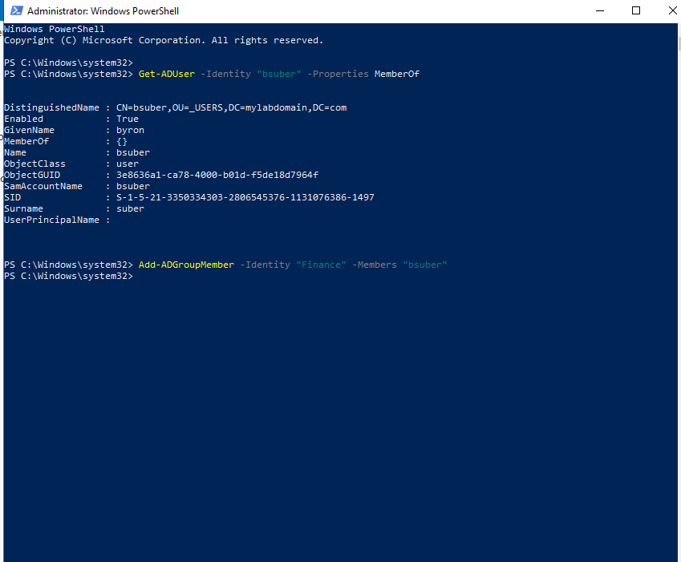
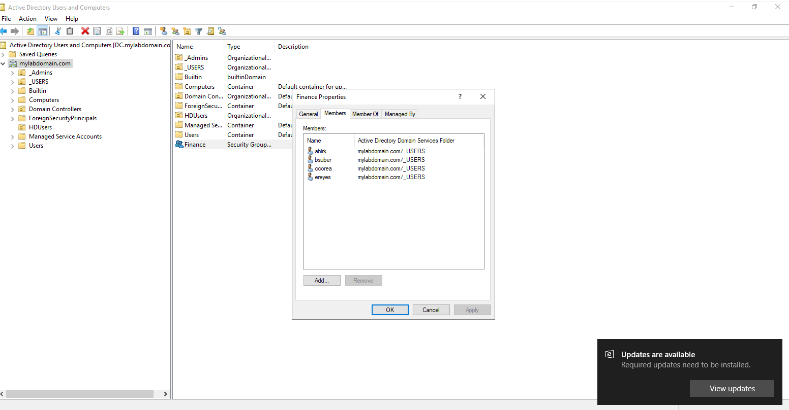
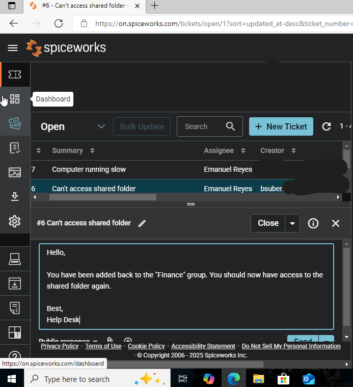

# Ticket #004 – Access Denied to Finance Shared Folder

**Date:** 2025-10-06  
**Requester:** bsuber  
**Priority:** High  
**Category:** Permissions & Access Control  
**Status:** Resolved  

---

## Description
User unable to access shared network folder `\\server\finance`.

---

## Actions Taken
1. Verified user group membership in Active Directory using PowerShell:  
   ```powershell
   Get-ADUser -Identity "bsuber" -Properties memberOf
2. Confirmed user was not part of Finance_Group.
3. Added user to the group:
   ```powershell
   Add-ADGroupMember -Identity "Finance_Group" -Members "bsuber"
4. Informed user to log off and back on to refresh permissions.

## Resolution

User successfully accessed the shared finance folder.

## Screenshots

<p align="center">
  <br/>
  <em>PowerShell output showing user not in the Finance group, and PowerShell command adding user to Finance group via <code>Add-ADGroupMember</code>.</em>
</p>

<p align="center">
  <br/>
  <em>ADUC Finance group properties showing user now listed as a member.</em>
</p>

<p align="center">
  <br/>
  <em>Spiceworks message confirming user was re-added to the group and access restored.</em>
</p>

## Notes

Demonstrates PowerShell proficiency, Active Directory group management, and access troubleshooting.
